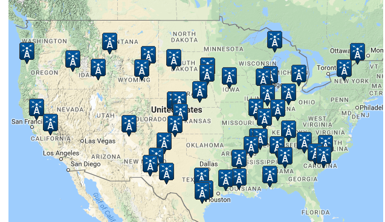

# Data Wrangling Process for US Army Corps of Engineers-Lock Performance Management System (LPMS) Data.
__Springboard Capstone 2 Data Wrangling Report__

****

### Table of Contents:
1. Data Acquisition & Description
2. LPMS Data Table Merges
3. Traffic Data Subsampling
4. Define Length of Delay
5. Map of Lock Locations
6. Additional Data: NOAA Weather

## 1. Data Acquisition & Description
The LPMS data are tables from US Army Corps of Engineers (USACE) Oracle Database with lock data from 2000 to 2017. Data provided in comma-separated-values format (.csv) included the following tables:

* TRAFFIC (1048576 rows)
* BARGE-TRAFFIC (3947393 rows)
* BARGES (15328548 rows)
* FLOTILLAS (7132360 rows)
* VESSELS (27058 rows)
* STALL-STOPPAGE (288818 rows)
* CHAMBERMSTR (240 chambers)
* LOCKMSTR (196 locks)
* RIVERMSTR (39 rivers)
* DISTRICTS (33 districts)

Initial processing for tables involved dividing large files by datetime fields, formatting fields, and creating calculated time events. These steps are outlined below:

__TRAFFIC.csv__

* Use command line to subset 17-year dataset into individual years for last 5 years ✅
	* To extract by year: “csvgrep -c 10 -m “/2017” TRAFFIC.csv > TRAFFIC-EXTRACT-2017.csv”
	* -c 10 indicates the column where the date data are stored
	* -m “/2017” specifies the exact content to match
	* I ran a line like this for each of 5 recent years to get 5 separate .csv files per year
* In Jupyter Notebook read each of the 5 TrafficExtractXXX.csv files and pickle them ✅
* Save each pickled file as individual years.
* Concatenate all 5 years into one Dataframe with 3039625 rows
	* 5-year Traffic Data: ‘traffic-2013-2017.pickle’ ✅
	* Converted all dates to datetime64[ns] dtype
	* Calculated ENTRY-TIME (Bow Over Sill to End Of Exit) ✅
	* Calculated EXIT-TIME (Start Of Exit to End Of Lockage) ✅
	* Calculated DELAY-TIME (Arrival Date to Start of Lockage) ✅
	* Primary Key: TRFC-PK: EROC, RIVER-CODE, LOCK-NO, CHAMBER-NO, LOCKAGE-TYPE, OPS-ID, VESSEL-NO 

__BARGE_TRAFFIC.csv__

* Read into Jupyter Notebook with pd.read-csv ✅
* BARGE-TRAFFIC does not have a datetime field.
* Relationship between TRAFFIC and BARGE-TRAFFIC is not one-to-one because each vessel in TRAFFIC may have multiple barges. ✅
* HEADERS:
	* EROC
	* RIVER-CODE
	* LOCK-NO
	* CHMBR-NO
	* OPS-ID
	* FLOTILLA-NO
	* VESSEL-NO
	* PVESSEL-NO
	* BARGE-ID
	* BARGE-TYPE
	* NUMBER-BARGES
	* NUMBER-PROCESSED
	* LINE-SEQ-NO: Renamed as "BT-line-seq" because not linked to column of same name in TRAFFIC
* PRIMARY KEY: EROC, RIVER-CODE, LOCK-NO, CHMBR-NO, LOCKAGE-TYPE, OPS-ID, VESSEL-NO, PVESSEL-NO, FLOTILLA-NO, BARGE-ID

__BARGES.csv__

* Read into Jupyter Notebook with pd.read-csv ✅
* HEADERS:
	* EROC
	* FLOTILLA-NO
	* PVESSEL-NO
	* BARGE-ID
	* NUMBER-BARGES
	* BARGE-TYPE
	* BARGE-WIDTH
	* BARGE-LENGTH
* Primary Key: BRG-PK (PVESSEL-NO, FLOTILLA-NO, EROC, BARGE-ID)

__FLOTILLAS.csv__

* Read into Jupyter Notebook with pd.read-csv ✅
* HEADERS:
	* EROC (with PVESSEL-NO = Foreign Key)
	* FLOTILLA-NO (with EROC, PVESSEL-NO = Primary Key)(
	* PVESSEL-NO (with EROC = Foreign Key)
	* FLOT-LENGTH
	* FLOT-WIDTH
	* FLOT-DRAFT-FT
	* FLOT-DRAFT-IN
	* STOP-CODE
	* NUM-LOADED-BRG
	* NUM-EMPTY-BRG
Primary Key: EROC , VESSEL-NO

__VESSELS.csv__

* Read into Jupyter Notebook with pd.read-csvDataFrame = vessels ✅
* PRIMARY KEY: EROC,  VESSEL-NO

__STALL_STOPPAGE.csv__

* To make 5-year DataFrame:
	* Read into LPMS-data-merging-calculations.ipynb notebook with pd.read-csv ✅
	* BEG-STOP-DATE made to.datetime dtype and made index ✅
	* END-STOP-DATE made to.datetime dtype ✅
	* Calculated stop-minutes and stop-days from BEG-STOP-DATE and END-STOP-DATE ✅
	* Filtered out 5 years of recent data: 1/1/2013 to 12/31/2017 = stall-stop-13-17 ✅
* Pickled data file: ‘stall-stop-2013-2017’✅
* PRIMARY KEY: EROC, RIVER-CODE, LOCK-NO, CHMBR-NO, BEG-STOP-DATE

__CHAMBERMSTR.csv__

* Read into Jupyter Notebook with pd.read-csv ✅
* DataFrame = chambermstr
* PRIMARY KEY: EROC, RIVER-CODE, LOCK-NO, CHMBR-NO

__LOCKMSTR.csv__

* Read into Jupyter Notebook with pd.read-csv ✅
* DataFrame = lockmstr
* PRIMARY KEY: EROC, RIVER-CODE, LOCK-NO

__RIVERMSTR.csv__

* Read into Jupyter Notebook with pd.read-csv ✅
* DataFrame = rivermstr
* PRIMARY KEY: RIVER-CODE

__DISTRICTS.csv__

* Read into Jupyter Notebook with pd.read-csv ✅
* DataFrame = districts
* PRIMARY KEY: EROC

## 2. LPMS Data Table Merges

The main dataframe 'traffic_13_17' is the basis for data analysis for this project because each row is an event of a vessel passing through a lock. At this stage we did not merge traffic_13_17 with other tables because the relationships were not one-to-one. Timestamped lock management events from January 1, 2013, through December 31, 2017, in these rows include calculated time events for delays and will be the focus of the predictive modeling.

The 'barge_traffic' dataframe does not contain datetime fields and is instead a record of barges passing through specific locks. Some vessels tow multiple barges so there are multiple rows of data per lockage event. Using the primary key for 'barge-traffic' I merged 3,947,393 rows with the 'barges' dataframe on the 'barge-traffic' primary key. 

`barge_traf_barges = pd.merge(barge_traffic, barges, how='inner', on=['PVESSEL_NO',` `'FLOTILLA_NO', 'EROC', 'BARGE_ID', 'NUMBER_BARGES', 'BARGE_TYPE'])`

The resulting dataframe 'barge-traf-barges' has an equal number of rows as barge-traffic due to the inner join. I merged this dataframe with the 'flotillas' dataframe using the 'barges' primary key. Finally, I merged the combined dataframe with 'vessels'. The resulting dataframe with 3,947,393 rows is pickled as 'barge-flot-vessles.pickle,' and includes 25 columns.

The third working dataframe of merged LPMS data tables is based on the 'stall-stoppage' table. Stall-stoppage is a record of both planned and unplanned halts in navigation. These events are linked to specific chamber, lock, river, district details and have datetime formatted beginning and ending times. From these times I calculated stop times in minutes ('stop-minutes') and days ('stop-days').  Two additional calculated time events can be calculated using the stop times: 

* Approach Time: SOL (start of lockage) to BOS (bow over sill) from TRAFFIC table minus ‘stoppage time’ from STALL_STOPPAGE table.
* Chambering Time: EOE (end of entry) to SOE (start of exit) from TRAFFIC table minus ‘stoppage time’ from STALL_STOPPAGE table.

In addition I added identifier rows for future merges with other dataframes. The column 'E_R_L' links to codes from the 'EROC,' 'RIVER_CODE,' and 'LOCK_NO' columns (liked by underscores) to create unique identifiers for each lock. I split the 'ARRIVAL_DATE' column into separate date and time columns: 'YYMMDD' and 'hhmmss'. The 'stall_stop_13_17' dataframe will allow my later to link individual vessels to locks that had either scheduled or unscheduled 'stoppages' on the same day.

## 3. Traffic Data Subsampling

Using uniform random sampling I took a subset of rows from the five-year 'traffic_13_17' dataframe. I calculated my sample size to include the number of rows equal to 2000 rows of vessel data for each of the 196 locks over the five-year period of study (size = 392,000). To take the random uniform sample from the dataframe of 3039626 rows I created an array of indices using numpy.random.choice without replacement:

`chosen_idx = np.random.choice(3039626, replace=False, size=392000)`

I then used the array of indices to subsample the 'traffic-13-17' dataframe:

`traf_sample = traffic_13_17.iloc[chosen_idx]`

My next step related to the subsampled traffic dataframe is to explore the distributions of delay times in my subsampled 'traffic' dataframe and use these findings to define a 'delay' for lockage procedures. Determine if amount of time that equals a delay is the same for all locks, or if delay should be determined on a lock-by-lock basis. See section #6 below.

## 4. Define Length of Delay

__One definition of delay__ My initial effort to define the length of time to define as a 'delay' for a vessel approaching a lock is chronicled in the ['Data Story EDA Statistics LPMS'](https://github.com/PassMoreHeat/springboard/blob/master/Capstone_2/Data_Story_EDA_Statistics_LPMS.ipynb) notebook. I determined from this work that defining the same length of delay for all locks is not appropriate. Including only non-zero delay-times I calculated the 75th percentile of delay time and assigned delay 'True' or 'False' to all vessels in the traffic dataframe. With delay-time of 110 minutes or more the overall proportion of vessels delayed was 0.16. However, the proportion of delays per lock varied widely. Two locks had over 85% of vessels 'delayed,' seven other locks had 40 to 60% of vessels with delay-times over 110minutes.

Based on EDA of delay_time per vessel I determined 'Delay' must be defined per lock. Each lock has different factors (age, lockage type, river traffic) that affects the normal lockage time. A delay of 110 minutes on the Hudson may be extreme while a delay of that length at the Industrial Canal in New Orleans is very common (80% of vessels take that long or longer).
The Inner Harbor Navigation Canal Lock (in New Orleans) was built in 1920 and has had some repairs but is a slowdown for several reasons:

> "the 1920s vintage lock has become a bottleneck between the nation's two highest-tonnage waterways—the Mississippi and the Gulf Intracoastal Waterway."
> 
> "...three different waterways—the Industrial Canal, the Intracoastal and the MRGO—were now using the same lock to connect to the river."
> 
> From: https://en.wikipedia.org/wiki/Industrial_Canal_Lock

__Define delay on a lock-by-lock basis__ My second attempt to define 'delay' for vessels waiting to enter lockage takes into account the actual differences in wait-times for each lock. Instead of calculating the 75th percentile of all delay-times, I applied a function to calculate the 75th percentile of delay-time for each lock. While this produced a similar overall proportion of delays in the full dataset (proportion delay = 'True' is 0.15), the proportions of delayed vessels per lock were much reasonable (delayed vessel proportions at high traffic locks are all 0.25 or lower). The code and exploratory analysis is in notebook ['EDA Per Lock and Table Build'](https://github.com/PassMoreHeat/springboard/blob/master/Capstone_2/EDA_Per_Lock_and_Table_Build.ipynb). Ultimately, I produced dataframes ready for machine learning with one row per lock per day over the five-year period of this study. The steps I took to define delay and filter down to one vessel per lock per day were:

1. Calculate 75th percentile delay per lock. (Longest delay definition was 1755 minutes)
2. Apply defined delay per lock to each vessel record (row) 
3. Explore patterns of delay per EROC, River, Lockage, Lock
4. Assign delay categories HIGH or LOW to individual locks based on proportion of delays
5. Explore patterns in delay count by year, month, day for vessels
6. Examine delays per lock & per day
7. Add stall stoppage information to main traffic delay dataframe
8. Start to build focal dataframe for machine learning (selected 10 high-traffic locks with high delay proportions)
9. Delete unnecessary columns, create full and reduced datasets for ML

## 5. Map of Lock Locations

Locks in the LPMS are located along 39 rivers mostly in the eastern half of the US but also in Washington State, especially along the southern boarder and in Northern Oregon (Figure 1). Through methodic exploration and wrangling of the vessel traffic data I identified 10 focal locks characterized by high vessel traffic and higher proportions of delays (Figure 1).

__Figure 1.__ Locations of 196 locks owned or managed by the US Army Corps of Engineers and monitored with the Lock Performance Monitoring System (LPMS). 

__Figure 2.__ Locations of 10 focal locks for the machine learning steps incorporating weather data. Lock locations are marked with red, blue and magenta triangles to make it easier to distinguish nearby locks. Focal locks are located in 5 states: Texas (3 locks), Indiana (1), Illinois (1), Louisiana (4), and Washington (1).

## 6. Additional Data: NOAA Weather

In addition to Lock Performance Management System data provided by USACE I also have identified a source for historical weather data. The National Oceanic and Atmospheric Administration's (NOAA) National Centers for Environmental Information provides free data from certain weather station across the United States (Figure 3). Using the ['Data Tool: Find a Station'](https://www.ncdc.noaa.gov/cdo-web/datatools/findstation) feature I identified 7 airport weather stations near focal lock locations. Three of these weather stations were near to two locks each and the data will be applied to both locations. 

__Figure 3.__ Locations of available historical daily temperature, precipitation, and wind weather records from NOAA's National Centers for Environmental Information (https://www.ncdc.noaa.gov/cdo-web/datatools/findstation)

For all seven airport weather stations I was able to acquire 100% of daily summaries for the five-year study period. The data categories I selected were: Air Temperature, Precipitation, Wind, and Weather Type. Below I list the variables I downloaded within these categories. 

My final dataframe ready to begin the machine learning stage of this project includes one vessel per day per lock at ten different USACE locks with high traffic. Linked to each lock per day I have daily weather summaries in these categories relevant to vessel traffic on waterways.

__Air Temperature__

* TAVG - Average Temperature.
* TMAX - Maximum temperature
* TMIN - Minimum temperature

__Precipitation__

* PRCP - Precipitation
* SNWD - Snow depth
* SNOW - Snowfall

__Wind__

* AWND - Average wind speed
* WSF2 - Fastest 2-minute wind speed
* WSF5 - Fastest 5-second wind speed
* PGTM - Peak gust time

__Weather Types__

* WT01 - Fog, ice fog, or freezing fog (may include heavy fog)
* WT02 - Heavy fog or heaving freezing fog (not always distinguished from fog)
* WT03 - Thunder
* WT04 - Ice pellets, sleet, snow pellets, or small hail" 
* WT05 - Hail (may include small hail)
* WT06 - Glaze or rime 
* WT07 - Dust, volcanic ash, blowing dust, blowing sand, or blowing obstruction
* WT08 - Smoke or haze 
* WT10 - Tornado, waterspout, or funnel cloud" 
* WT11 - High or damaging winds
* WT13 - Mist
* WT14 - Drizzle
* WT15 - Freezing drizzle 
* WT16 - Rain (may include freezing rain, drizzle, and freezing drizzle)" 
* WT17 - Freezing rain 
* WT18 - Snow, snow pellets, snow grains, or ice crystals
* WT19 - Unknown source of precipitation 
* WT21 - Ground fog 
* WT22 - Ice fog or freezing fog

***