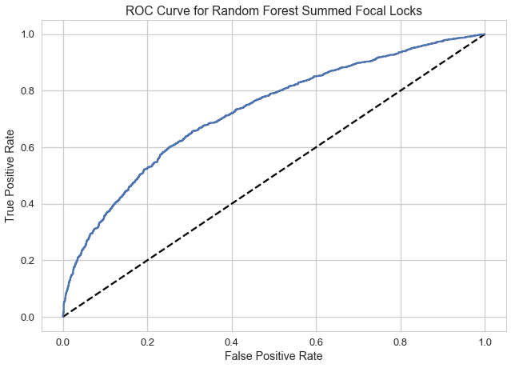

# Predicting Vessel Delays for Corps of Engineers-Lock Performance Management System Data.
__Springboard Capstone 2 Final Report__

_By Heather A. Passmore, Ph.D._

_The following is the final report written by H. Passmore for the Springboard Career Track Capstone 2: Predicting Vessel Delays for Corps of Engineers-Lock Performance Management System._
****

### Report Outline:
1. Problem Definition and Objectives
2. Client Profile
3. Data Sources
	4. Lock Performance Data
	5. NOAA Weather Station Data 
6. Data Wrangling Approach
	4. Methods for Cleaning and Wrangling
	5. Preprocessing Steps for Machine Learning
4. Exploratory Analyses and Statistics
5. Delay Classification
	6. Feature Preparation and Data Splitting
	7. Model Selection
	8. Model Fitting and Evaluation
	9. Important Features and Model Results
6. Caveats and Future Directions
7. Recommendation to USACE
9. Acknowledgements
10. Helpful Resources
11. Key to Codes and Variables

## 1.0 Problem Definition and Objectives

Cargo vessel traffic on United States waterways and through US Army Corps of Engineers-managed locks plays an important role in the transport of foreign and domestic goods into and out of the United States. Locks are owned and operated by the US Army Corps of Engineers (USACE), range in age from 14 to 144 years since construction, and are considered by many to have surpassed their life-expectancy. __Delays and failures of locks have immediate financial implications for shipping companies and for the USACE.__ 

My focus is to determine what factors predict delays for vessels as they approach locks and await lockage. The Lock Performance Management System (LPMS) logs 'delay-time' for individual vessels approaching a lock. Delay-time is the time elapsed from the arrival of a vessel at a lock to the start of lockage. While all vessels have some delay-time, occasionally the delay before lockage is extensive -- lasting as long as 1754 minutes (or 29 hours) during the period of study. __My goal is to determine what factors predict extended delays.__ To build predictive models of extended delay I selected ten focal locks with high traffic and high proportions of vessels with longer delay-times. Using logistic regression and random forest models, my goal is to classify the conditions associated with vessel delays and identify features useful for predicting delays. My supervised learning models are built from daily vessel traffic at 10 focal locks over a period of 5 recent years (one vessel per lock per day as available). 

## 2.0 Client Profile
The Institute for Water Resources (IWR) headquartered in Alexandria, VA is a Field Operating Activity of the United States Army Corps of Engineers (USACE) responsible for water resources planning and water management programs. One focused center of IWR is the Navigation and Civil Works Decision Support Center (NDC) and its Waterborne Commerce Statistical Center (WCSC) in New Orleans, LA. These entities focus on data collection organization for waterborne commerce, vessel characteristics, port facilities, dredging information, and information on navigation locks.

My contact at USACE is Steven Riley from the Navigation and Civil Works Decision Support Center. The NDC regularly analyzes commodity and transport data collected from lock operations. However, they have identified a need for a deeper analysis of the national network of waterway locks. Data exploration to find relationships relevant to budgeting, maintenance, and scheduling would inform their planning for future operations. Specifically, NDC would like to know if increased lockage times indicate that a stoppage is imminent. Are there factors that could be used to predict delays and stoppages? 

In this Springboard Capstone Final Report and in my report to USACE I include information on the factors that are most influential on vessel delays. USACE will be able to use general findings about influential variables from my report to frame future analysis and potentially future lock maintenance schedules. My findings will inform stakeholders internal and external to the USACE. Further, through my exploration and modeling I have a deeper understanding of the LPMS system. I am eager to recommend and continue developing models that add additional insight for improving the efficiency of our national lock and dam system.

## 3.0 Data Sources

The predictive models for the project incorporate data from two sources: The US Army Corps of Engineers Lock Performance Management System database and The National Oceanic and Atmospheric Administration's (NOAA) weather stations.

### 3.1 Lock Performance Data

The LPMS data are tables from US Army Corps of Engineers (USACE) Oracle Database with lock data from year 2000 through 2017. The full database includes separate tables for vessels, barges, flotillas, stall stoppages, and vessel traffic. Additional tables contain identifiers and details for lock locations, lock chambers, locks, rivers, and districts. For this initial effort I focused on vessel traffic data,  metrics from stall stoppage records, lock locations, and lock, river, and district identifiers.

Initial processing for tables involved dividing large files by date-time fields, formatting fields, and creating calculated time events. Once  my first machine learning questions developed toward predicting where and when longer delays occurred, the data table most useful to me was the vessel traffic table which documents the passage of each vessel through locks. I also used the stall-stoppage table to link scheduled and unscheduled events where navigation is either slowed (stalls) or halted (stoppages) to individual locks and days. Secondarily I used identifiers from river-master, lock-master, and districts to identify rivers and locks by name and lock-locations to build maps (Figure 1).

__Figure 1.__ _Locations of 196 locks owned or managed by the US Army Corps of Engineers and monitored with the Lock Performance Monitoring System (LPMS). The lock-locations table includes latitude and longitude coordinates for each lock. With these I used Basemap from Matplotlib to plot maps of all lock locations (Hunter 2007)._

For my data mining, exploration, and modeling efforts I sampled a subset of the available data. The full database of LPMS records covers 17 years (from 2000 through 2017) of vessel traffic through 196 locks on 38 rivers in the eastern half of the US plus Washington and Oregon. Details of my initial data acquisition and wrangling are described in my [LPMS Milestone Report](https://github.com/PassMoreHeat/springboard/blob/master/Capstone_2/LPMS_Milestone_Report.md). My first subset of data focused on just the last 5 years of vessel records (n = 3,039,626 records). From this I took a uniform random sample of 392,000 rows of vessel data. Through exploration of the sampled vessel data I determined a definition for extended vessel delay by lock and selected 10 focal locks with high traffic and high proportions of delayed vessels for my machine learning and classification study. Details for focal locks (River, Lock Name, Latitude, Longitude) are below in section 11, 'Keys to Codes and Variables'.

### 3.2 NOAA Weather Station Data 

In addition to Lock Performance Management System data provided by USACE I acquired historical weather data to pair with locks by location. The National Oceanic and Atmospheric Administration's (NOAA) National Centers for Environmental Information provides free data from certain weather station across the United States (Figure 3). Using the ['Data Tool: Find a Station'](https://www.ncdc.noaa.gov/cdo-web/datatools/findstation) feature I identified 7 airport weather stations near focal lock locations. Three of these weather stations were near to two locks each and the data will be applied to both locations. 

__Figure 3.__ _Locations of available historical daily temperature, precipitation, and wind weather records from NOAA's National Centers for Environmental Information (https://www.ncdc.noaa.gov/cdo-web/datatools/findstation)._

For all seven airport weather stations I acquired 100% of daily summaries for the five-year study period. The data categories I selected were: Air Temperature, Precipitation, Wind, and Weather Type. Please see [Data Wrangling Report](https://github.com/PassMoreHeat/springboard/blob/master/Capstone_2/Data_Wrangling_Report.md) for details of these variables. 

My final data frame for the machine learning stage of this project includes one vessel per day per lock at ten different USACE locks with high traffic. Linked to each lock per day I have daily weather summaries in these categories relevant to vessel traffic on waterways.

## 4.0 Data Wrangling Approach

### 4.1 Methods for Cleaning and Wrangling

Following initial sampling of the vessel traffic table my main data frame consists of 392,000 rows with eight 'date-time' columns, four float continuous variable (float) columns, four integer columns, and seven text columns (object or string fields). With this even sample over the five-year study period I 1) explore and define extended delay per lock, 2) link metrics from unplanned stall-stoppages, 3) link daily weather summaries and 4) identify 10 focal locks for machine learning. Ultimately, with a focus on 10 locks I explore the distribution of delay-time for districts, rivers, locks as I determine my working definition of 'delay' and begin work to predict delay from lock, vessel and weather characteristics.

__Definition of delay__ Through exploration of vessel traffic data I determined that defining the same length of delay for all locks is not appropriate. Including only non-zero delay-times I calculated the 75th percentile of delay time and assigned delay 'True' or 'False' to all vessels in the traffic data frame. With delay-time of 110 minutes or more the overall proportion of vessels delayed was 0.16. However, the proportion of delays per lock varied widely. Two locks had over 85% of vessels 'delayed,' seven other locks had 40 to 60% of vessels with delay-times over 110 minutes. One definition of extended delay across all locks does not make sense

Instead, I calculated the 75th percentile of delay-time by lock. I applied this definition on a lock-by-lock basis to define 'delay-category' as a binary variable, and my ultimate target variable in machine learning, where 0 is no-extreme delay and 1 is extreme-delay. For each vessel approaching a lock, if the column delay-time is greater than the 75th percentile of delay for that lock, then that vessel is categorized as 'delayed' at that lock. Within the five-year sample of vessel traffic data, under this definition of extreme delay there are n = 333,264 vessels at locks with no delay, and 58,736 vessel records in the extreme delay category or 15% of all vessels in the sample.

__Unplanned stall-stoppage metric__ The purpose of the stall-stoppage data for this project was two-fold. First, I used records of 'scheduled' stalls to remove vessel records at a lock on a day when there was a scheduled stoppage. Scheduled stoppages include regular maintenance, periods of time when personnel are not attending the lock, etc. These stall events may result in longer delay times as vessels approach locks, but I do not want to include them in my predictive model in my effort to determine what external events cause delays for vessels. Second, I used the stall-stoppage table to extract information about unplanned stalls and stoppages and to connect the duration and reason-code of these unplanned stalls to the lock/day records in my machine learning dataset.

The five-year data frame of stall stoppage data has 288,818 entries. In subsequent steps I divided the table into separate data frames for scheduled and unscheduled stalls (scheduled stop = True or False). Where there was a scheduled stall stoppage at a lock on a day I removed data for that lock/day from the Traffic data frame so that scheduled stalls did not inflate the measure of delay  or influence model predictions of delay. Further, I used pivot_table on the data frame of unscheduled stalls to produce a data frame with one record per lock per day with columns for each REASON-CODE and the mean of delay-time for that day/reason in each cell. This table, merged with the traffic table increases the type of information available for building the models.

__Figure 2.__ _Proportions of vessels in the extended delay category for each USACE Division-District ('EROC,' or Engineer Reporting Office Code) in the full 5-year data set. Some districts have much higher proportions of delayed vessels than others._

__Identifying Focal Locks for Machine Learning__  To determine a subset of focal locks I explored patterns of delay per district, river, lockage type, and lock (Figure 2 & 3). Next, I assigned delay categories HIGH or LOW to individual locks based on proportion of delays per lock. The division between HIGH and LOW delays is based on the frequency distribution of delays (Figure 4). In order to eliminate locks with low rates of delayed vessels I dropped all vessels/lock data for locks with LOW proportions of delay. By exploring patterns of delays over time and rates of delays at different scales I identified outlier locks and dropped those locks from the data frame. Outliers included locks with very low traffic but high proportions of delay, individual rivers with fewer than 10 delays over 5 years, and individual locks with fewer than 1000 delays over 5-years. From the remaining locks I identified 15 with the highest vessel traffic and proportions of delays. I selected 10 of these with the goal of having focal locks across several districts and rivers (Figure 5).

__Figure 3.__ _Proportions of vessels in the extended delay category for each Lockage Type (the configuration of vessels as they transit a lock; see section 11.0 for key to lockage type codes) in the full 5-year data set. Lockage type 'J' is a 'Jackknife' where the flotilla is rearranged. This lockage is associated with a higher proportion of delays, but is also rare and did not end up in the final machine learning dataset._

__Figure 4.__ _The distribution of delay proportions for locks. The lock with nearly 50% of vessels delayed was an outlier with a total of two vessels during the study period, one of which was categorized as delayed. From this distribution I determined the artificial cut-off for 'low' and 'high' proportions of delays and dropped all locks with delay proportions less than 0.15 from the pool of locks for machine learning._

Finally, I randomized the data, dropped duplicates per lock/day for delayed and non-delayed locks separately, re-combined the two delay categories again and dropped duplicates if there were delay/no-delay duplicates per lock/day. In these cases I kept the vessel that was delayed. From this full dataset of many locks and one vessel/day I created the data frame for machine learning with vessel traffic for 10 focal locks (see section 11.0 for Focal Lock details).

__Figure 5.__ _Locations of 10 focal locks for the machine learning steps incorporating weather data. Lock locations are marked with red circles. Focal locks are located in 5 states: Texas (3 nearby locks), Indiana (1), Illinois (1), Louisiana (4 locks — two pairs of nearby locks), and Washington (1)._

The focal lock data consists of 15538 vessel records including columns related to vessel types, lockage types, and maximum duration of unplanned delays. I then merged this data with nearby daily airport weather station data. Weather data includes temperature, wind, and precipitation variables as well as a binomial field for occurrences of extreme weather types (fog, hail, tornado, etc.). This focal data set contains 8435 vessels that not delayed and 7103 vessels in the extreme delay category.

### 4.2 Preprocessing Steps for Machine Learning

In order to apply classification algorithms to the LPMS data from 10 focal locks I processed the data to encode binary variables, create dummy columns for categorical variables, create date features from the date-time stamp, impute values for the rare missing observation in a column, and replace 'NaN' cells with '0'. Following these preprocessing steps the machine learning lock data frame contains the following categories of variables.

__Target (1):__

*  'delay-cat,' the target variable for classification, delay = 1. 

__Binary fields (5):__ 

* Did a vessel require mechanical or vessel-powered assistance at the lock? _'assist'_ where 1 = yes.
* Was there one or more recorded extreme weather types that day? _'WType'_ where 1 = yes.
* Three binary date features, (_'weekday,' 'night', 'holiday'_), where 1 means 'True' for the variable name.

__Categorical fields made into binary 'dummies' columns:__ 

* Unique identifier for District/River/Lock, _'E-R-L'_, 9 binary columns.
* Code for type of lockage, _'lockage'_, 5 binary columns.*
* Code for Vessel Function Type, _'VFT'_, 7 binary columns.*
* Field for each year in study data, _'year'_, 4 binary columns.
* Date-time data lumped into four seasons, _'season'_, 3 binary columns.

__Numerical fields:__

* The maximum duration of an unplanned stall at a lock: 'unplan-max-stop'
* Ten weather metrics (_'AWND', 'PGTM', 'PRCP', 'SNOW', 'SNWD', 'TAVG', 'TMAX', 'TMIN', 'WSF2', 'WSF5'_).*

*Note: see section 11.0 below for a key to 'lockage', 'VFT', and weather codes.

## 5.0 Exploratory Analyses and Statistics

Through exploration of (1) the whole 5-year vessel traffic data set, and (2) the focal locks paired with weather data, I identified factors associated with differences between delayed and not-delayed vessels. Overall, the number of delayed vessels at USACE locks increased over the five-year study period (Figure 6). In addition, seasonal patterns of vessel delays indicate delay rates are reduced by half during winter months (Figure 7).

__Figure 6.__ _Yearly counts of delayed vessels across all USACE locks from 2013 through 2017. Frequency of extended delays increases over time. Delay is defined as the recorded delay-times greater than the 75th percentile of delay time at a given lock._

__Figure 7.__ _Monthly counts of delayed vessels across all USACE locks from 2013 through 2017. Delay frequency has a seasonal pattern with fewer delays, and perhaps less vessel traffic during the colder seasons. Delay is defined as the recorded delay-times greater than the 75th percentile of delay time at a given lock._

Focal locks are located within 5 separate Districts and on 5 different rivers. During the period of study half of the focal locks have higher numbers of delay-days (days when there is at least one delayed vessel approaching the lock) than non-delay days (Figure 8). One factor that may affect vessel passage through locks is lockage-type. Lockage-type is the configuration of vessels as they transit a lock. Although this factor may be more likely to affect approach time and delay time for subsequent vessels than for the focal vessel (if different lockage-types have more complex procedures for entering and exiting locks) we find reason to include it in this study. In the focal lock dataset Open Passage (O) and Straight (S) lockages are the most common (Figure 9).

__Figure 8.__ _Delay-day counts for focal locks over 5-year period of study. For 50% of focal locks there are more delay-days than non-delay-days over the period of study. Codes for lock identification, 'E-R-L', indicate the District ('E' for EROC), River, and Lock codes. Target binomial delay-cat, delay = 1, no-delay = 0._

__Figure 9.__ _Lockage-type, the configuration of vessels as they transit a lock, is more likely to affect approach time and delay time for subsequent vessels if passage is delayed during lockage. Here Open Passage (O) and Straight (S) lockages are the most common lockage types._

Weather conditions may affect delay-times as vessels approach locks. Although this is not a factor that USACE can control, understanding the effects of weather types and extreme weather events could help USACE develop contingency plans for various seasons and specific weather conditions. In order to constrain the spread of delay-time (in minutes) I log-transformed this variable for graphing and statistical tests. Average wind speed (AWIND) appears to have a positive linear relationship with log-delay-time for vessels in the extreme delay category (Figure 10). A t-test of average wind speed for delay and non-delay vessels indicates a significant difference between the groups (t = 2.023, p = 0.04) however, the mean average wind speed is slightly greater for the non-delay group.

__Figure 10.__ _Average wind speed and log-delay time may have a linear relationship, but a comparison of wind speeds for the two delay categories does not indicate a meaningful difference. In fact, average wind speed was slightly greater on the days with non-delay vessels._

Other weather variables may be associated with delay-days for vessels at locks. Daily minimum temperature during winter seasons may negatively influence delay times. Differences in daily minimum temperatures were significantly different between the delay categories (t =-4.5, p=0.0). Overall mean minimum temperatures are very similar (Figure 11).

__Figure 11.__ _Average minimum temperature is significantly different between delay and non-delay vessels but overall means are similar._

One measure of snow fall ('SNOW') from NOAA stations occurs relatively infrequently within the 5-year study. While there may be a linear relationship between snowfall and log-delay-time in the two delay categories (Figure 12) there is not a statistical difference between snowfall amounts for the two delay categories based on a t-test.

__Figure 12.__ _Measures of daily snowfall may be linearly related to delay-time but snowfall comparisons between delay and non-delay groups are not significantly different._

While some quantitative comparisons of time, weather, vessel, and lock-related variables may indicate differences between the binary target category delay/no-delay, there are not strong indications of significant statistical differences for most metrics. Combining these variables to build classification algorithms can potentially give us more insight into the factors affecting longer vessels delays.

## 6.0 Delay Classification

My approach for the Lock Performance Management System study of vessel delays is a supervised learning classification problem. My binary target variable is delay (y) as defined by my prior exploratory analyses. The features included as predictive variables include binary and categorical features in three categories: 1) lock or vessel related, 2) weather metrics, 3) date/time-derived features. The null hypothesis for this classification problem is that no vessels are delayed as they approach a lock. My modeling task is to predict which vessels will be delayed with a greater accuracy than the null.

### 6.1 Feature Preparation and Data Splitting

The data frame prepped for machine learning, prior to splitting for training and testing, included 15538 rows where each row is a vessel at a lock on a day. I started with 44 features plus the target, 'delay-cat'. The 44 features comprise 11 continuous variables and 33 binary fields. Five of the binary fields are single variables. The remaining 28 columns of matrix X are binary dummy variables made from five categorical fields ('E-R-L', 'lockage', 'VFT', 'year', and 'season'). Each of these has one fewer column that the number of levels for that category to avoid redundancy in the model. The features included in the initial model are those vetted and checked through exploratory data analysis steps. Composite levels of some categories were created when several categories were infrequent.

After separating the matrix of features (X) from the target array (y) I divided my full dataset into training and test sets with a 75%/25% split with stratification on the target variable (y). I used the training data (X-train and y-train) to fit the models and tune the hyper parameters and the test data (X-test and y-test) to evaluate the tuned models and to identify the best performing model. To compare model performance I use the area under the receiver operating characteristic curve, or AUC score. In addition to the full train and test datasets for X and y, I further subsampled these data frames using masks for each individual lock. Thus I was able to compare not just different classifiers, but the same classifiers on the subset of data for each focal lock. Since delay times varied greatly by lock and I defined delay based on delay times for that lock these single-lock models have the potential to be better classifiers for delay.

### 6.2 Model Selection

To predict vessel delay categories I fit the data with two classifiers: Logistic Regression (with LogisticRegressionCV for cross validation of hyper parameters) and Random Forest followed by hyper parameter tuning with GridSearchCV. I focused on these two appropriate models while incorporating several other methods in my approach:

1. Compare fit of original dataset to one where all continuous variables are scaled or standardized.
1. Explore model fit after implementing Recursive Feature Elimination (scikit-learn, Pedragosa 2011).
1. Interpreting models by reviewing importance values of each feature.
1. Modeling individual locks separately to potentially improve prediction success.

Logistic regression for classification has the benefit of being simple and easy to interpret. In addition logistic regression classifiers return coefficients useful for assessing the importances of individual features.

The ensemble decision tree classifier Random Forest is good for fitting models with categorical features, works well with high dimensional data, and usually runs efficiently. While decision tree classifiers are prone to overfitting, random forest classifiers tend to overcome that problem because they are ensemble models. Further, using feature importances, random forest models are generally easy to interpret.

### 6.3 Model Fitting and Evaluation

_Scaling and Standardization of continuous variables._ With the modules from scikit-learn preprocessing library I separately applied the MinMaxScaler and the 'scale' function to all continuous variables. Based on AUC scores for both Logistic Regression and Random Forest models fit with the scaled and standardized arrays these transformed did not improve predictions. Model performance was substantially lower (AUC = 0.57) than the models run on the untransformed data (AUC = 0.64) and these pre-processing steps will not be used.

_Recursive Feature Elimination (RFE)._ I applied Recursive Feature Elimination (RFE) from scikit-learn preprocessing to the Logistic Regression model and the Random Forest model. In RFE the estimator is trained on the initial set of features and the coefficients or feature importances are calculated (depending on the classifier). The least important features are removed recursively until the 'number of features to select' is reached. First, I set the 'number of features to select' to 10 features and then to 15 features. For both versions I set 'step' to 1 so that one feature is removed after each iteration. I then used the top ranked features (10 and 15 respectively) to re-fit the models. Eliminating features with RFE to 10 and 15 features did not improve model predictive power (Table 1).

_Classifying delay with 10 focal locks._ My first modeling effort included the full training set sampled from the data for 10 focal locks and 44 features. For this set of training and testing data the Random Forest classifier with hyper parameter tuning has a higher area under the receiver operating characteristic curve (ROC-AUC= 0.728; Table 1). The focal lock Random Forest model performed better than Logistic Regression Classifier fit wiht 44 features and better than the either classifier with recursive feature elimination (Table 1). The Random Forest Classifier ROC-AUC score calculated from the predicted probabilities of each lock modeled separately (see below) was very similar to the full Random Forest Model (Table 1, Random Forest Summed Focal Locks, AUC = 0.727).

| Classifier         |n-features| ROC-AUC score | tuned parameters |
| -----------------       |---|--------------------|------------|
| LogisticRegressionCV    | 44 | 0.663 | Cs=10 | 
| Random Forest with GridSearchCV | 44 |0.728|'max-features': 30, 'min-samples_leaf': 17, 'min-samples-split': 22|
| LogisticRegressionCV with RFE     | 10 | 0.630  |Cs=10| 
| Random Forest with RFE | 10     | 0.545 |'max-features': 3, 'min-samples_leaf': 17, 'min-samples-split': 7|
| LogisticRegressionCV with RFE     | 15 | 0.653  |Cs=10| 
| Random Forest with RFE | 15     | 0.637 |'max-features': 3, 'min-samples_leaf': 17, 'min-samples-split': 7|
| Random Forest Summed Focal Locks | 35     | 0.727 |n/a; AUC from summed focal lock predicted probabilities|

__Table 1.__ _Name and details of each estimator fit to the test set for focal locks (n-rows = 3885), the number of features included in the model, and the ROC-AUC score for predicting on the test set. Hyper parameter tuning is already incorporated for each estimator. The parameter range is reduced for the RFE models since they include fewer features. Random Forest ROC-AUC score calculated from the predicted probabilities for models (0.727) for each individual focal lock is similar to score for the tuned full Random Forest model (0.728)._

_Classifying delay for individual locks._ Subsequently I fit both classifiers to training and testing sets for individual locks.  Without the 9 features of lock identifiers in the model there are 35 features included (Table 2). The test sets used to calculate the scoring metric AUC have different numbers of rows depending on the number of records per lock. With all available features included and after hyper parameter tuning the Random Forest classifier performed better based on AUC score for 5 locks. The Logistic Regression model was best (although sometimes marginally) for five locks. To compare individually fit models to the best-fitting Random Forest model with all focal locks, I calculated the ROC-AUC score by concatenating the predicted probabilities of y for each lock. The score (0.727) was very similar to the ROC-AUC score for the full model (Table 1).

| Lock Code  |Classifier|n-features| ROC-AUC score |
| ----------------- |------------|----------------------------|--------|
| B2_GI-3  | LogisticRegressionCV  | 35 | 0.745 | 
| B2_GI-3  | Random Forest with GridSearchCV  | 35 | 0.759 | 
| B2-GI-4  | LogisticRegressionCV  | 35 | 0.738 |
| B2-GI-4  | Random Forest with GridSearchCV  | 35 | 0.796 |
| B2-GI-77 | LogisticRegressionCV | 35 | 0.713 |
| B2-GI-77 | Random Forest with GridSearchCV | 35 | 0.731 |
| B3-MI-27 | LogisticRegressionCV | 35 | 0.622 |
| B3-MI-27 | Random Forest with GridSearchCV | 35 | 0.611 |
| G3-WS-1	 | LogisticRegressionCV | 35 | 0.728 |
| G3-WS-1	 | Random Forest with GridSearchCV | 35 | 0.723 |
| H2-OH-76 | LogisticRegressionCV | 35 | 0.599 |
| H2-OH-76 | Random Forest with GridSearchCV | 35 | 0.639 |
| M3-GI-11 | LogisticRegressionCV | 35 | 0.613 |
| M3-GI-11 | Random Forest with GridSearchCV | 35 | 0.674 |
| M3-GI-12 | LogisticRegressionCV | 35 | 0.667 |
| M3-GI-12 | Random Forest with GridSearchCV | 35 | 0.638 |
| M3-GI-14 | LogisticRegressionCV | 35 | 0.767 |
| M3-GI-14 | Random Forest with GridSearchCV | 35 | 0.764 |
| B2-FB-41 | LogisticRegressionCV | 35 | 0.814 |
| B2-FB-41 | Random Forest with GridSearchCV | 35 | 0.755 |

__Table 2.__ _For individual locks, the classifier, number of features, and AUC-score from predicting on the test data.  Because each lock has a different number of records the number of rows for the test data also varies per lock. Hyper parameter tuning is already incorporated for each estimator._

### 6.4 Important Features and Model Results

Although classification of delay category was successful with the tuned Logistic Regression classifier, the best performing model for focal locks and for several individual locks was the Random Forest classifier. The area under the receiver operating characteristic (ROC) curve calculated from the true positive rate and false positive rate for a range of decision thresholds is high for half of the random Random Forest models (Table 2). 

Each feature modeled by the random forest classifier has a corresponding feature importance. The highest importance values for the focal lock model and three individual locks are below (Table 3). For all four example models the top 5 feature importances are weather metrics including average wind speed, minimum temperature, maximum temperature, fastest 5-second wind speed, and fastest 2-minute wind speed. Subsequent high-importance features include individual years, night, weekday, and spring season.

| Focal Locks |Lock B2-GI-4|Lock B2_GI-3| Lock M3-GI-14  | Lock B2-FB-41  |
| ----------------- |------------|----------------------------|--------|--------|
| AWND | TMIN  | AWND | AWND |  TMIN |
| TMAX   | TMAX  | TMIN | TMIN | WSF5 |
| TMIN   | AWND  | TAVG | TMAX |TMAX |
| WSF5   | TAVG  | TMAX | WSF5 |AWND |
| WSF2  | WSF5 | WSF5 | WSF2 |WSF2 |
| TAVG  | WSF2 | WSF2 | year-2016 |PRCP |
| PRCP  | year-2015 | year-2014 | PRCP | lockage-S |
| night | season-spring | PRCP | year-2014 | weekday |
| weekday | PRCP | unplan-max-stop | year-2017 | lockage-O |
| WType	 | year-2016 | weekday | weekday | year-2017
| season-spring  | night | night | WType | night |
| year-2016 | year-2014| year-2017 | night | VFT-K |
| year-2015  | weekday | season-spring | season-spring | year-2015 |

__Table 3.__ _Highest feature importances from Random Forest Classifier fit to the full set of focal locks and three individual locks. Feature importance values for these top 13 features for five select Random Forest models are greater than 0.018._

__Figure 13.__ _Receiver operating characteristic curve from the predicted probabilities of the target (y) for 10 focal locks modeled individually. The predicted probabilities for each model were concatenated, as were the y-test arrays, to calculate the score. This summed ROC-AUC value is effectively the same as the full focal lock Random Forest Model score._

Modeling features that do not have strong influence on the random forest predictive models include vessel and lock categories like vessel function type and lockage type. In the full model of the ten focal locks individual lock features do not rank in the top 15 important features. This indicates that although we know there is some variation between individual locks we may be able to focus on modeling all locks together and improve predictive power instead by selecting additional predictive features to the model.

__Based on the consistency of the top features between the full focal lock model and the individual lock models I recommend implementing Random Forest Classification to model vessel delays. Weather variables and time/date variables have the greatest influence on delay prediction, while features related to vessels and lockage are not as influential. The consistent importance of weather- and time-related features suggests that delays related more to external factors, not features of the vessels or locks. This information can be used by lock managers and vessel operators to manage lock schedules and plan routes.__

## 7.0 Future Directions and Caveats

The predictive models to classify vessel delays as cargo ships approach locks indicate that some of the strongest predictors of delay are external to both lock and vessel features. Delays may be more related to weather conditions, time of day, and time of year than what type of vessel is awaiting lockage. While these factors are beyond the control of USACE they can include details and contingencies to account for weather and seasonal delays in their vessel traffic management plans.

Fortunately, there is also much more to be learned from the LPMS data. My initial data mining and modeling effort focused on vessel traffic and unplanned stoppages but there are many other features available in the full LPMS database. My future modeling efforts would incorporate additional vessel and lock features not included in this project such as number of barges, flotilla metrics (length and width), and chamber types. Further, there are other target variables worth focusing on. Potential machine learning tasks could include linear regression to predict duration of other timed events such as entry time and exit time for vessels. If maintenance schedules are a specific concern for USACE then additional maintenance history for each lock could be used to classify unscheduled stalls and stoppages.

## 8.0 Recommendation to USACE

Based on my findings that weather conditions and time-variables are the most influential factors affecting delays for vessels awaiting lockage, the USACE should revisit current management plans for lock procedures. If vessels are unreasonably delayed due to weather and time of travel USACE can advise vessel operators to consider forecasts and known heavy traffic days and times when planning routes. Further, USACE can provide valuable information to stakeholders about conditions and travel dates likely to be associated with longer-than-usual delays. Depending on date, conditions, and location USACE can easily provide delay-time estimates to stakeholders (above or below the 75th percentile of delay per lock). Using the per-lock definition of extreme delays vessel operators can plan travel to avoid longer delay times. 

Predictive models of factors affecting lockage delays can be implemented by USACE for internal planning and scheduling. My model and future models can be designed to update and re-tune when additional years of data are available. These models could be useful to USACE and NDC into the future.

USACE makes some of their lock data available to the public through the [LPMS Public Web](http://corpslocks.usace.army.mil/lpwb/f?p=121:1:7534946428825:::::). They also produce annual reports for related topics like Waterborne Container Traffic, Commodity Indicators, Ports and State Data, Domestic Waterborne Traffic by Commerce Type, etc. These findings can be incorporated into publicly shared analysis of US waterways traffic and locks. Having outwardly visible products is an important part of the mission of USACE and IWR to "provide forward-looking analysis and research in developing planning methodologies to aid the Civil Works program" and to provide " (a) analysis of emerging water resources trends and issues, (b) state-of-the-art planning and hydrologic engineering methods, models and training, and (c) national data management of results-oriented program and project information across Civil Works business lines." These and future models can enhance and improve these analyses.

Ultimately, deployment of a real-time delay tool for stakeholders is feasible. By monitoring the predictive model over a period of time USACE can make adjustments if cargo shipping patterns change based on economic or climatological externalities.  A sensor metric (such as precision/recall) could be used to detect changes below a certain level and the model would be re-trained and deployed to improve prediction accuracy. Deployment of a planning tool for vessel operators would reduce travel time and expenses for users and USACE lock management. 

## 9. Acknowledgements
I am grateful to Springboard for supporting and facilitating my Data Science studies. I thank Ben Bell, my Springboard Mentor, for his guidance and support during my exploration of this project. I appreciate Steven Riley, USACE, and NDC for their willingness to share historical LPMS data for this project. Thanks also to the Community of Springboard mentors and students for feedback along the way.

## 10.0 Helpful Resources
[FactCard](http://www.navigationdatacenter.us/factcard/FactCard2016.pdf), 2016. The US Waterway System 2016 Transportation Facts & Information. Navigation and Civil Works Decision Support Center, US Army Corps of Engineers. http://www.navigationdatacenter.us/factcard/FactCard2016.pdf

Hunter, J.D. "Matplotlib: A 2D Graphics Environment," in Computing in Science & Engineering, vol. 9, no. 3, pp. 90-95, May-June 2007.
doi: 10.1109/MCSE.2007.55

[LPMS Public Web](http://corpslocks.usace.army.mil/lpwb/f?p=121:1:7534946428825:::::) http://corpslocks.usace.army.mil/lpwb/f?p=121:1:7534946428825:::::

Pedregosa, F., Varoquaux, G., Gramfort, A., Michel, V., Thirion, B., Grisel, O., Blondel, M., Prettenhofer, P., Weiss, R., Dubourg, V., Vanderplas, J., Passos, A., Cournapeau, D., Brucher, M., Perrot, M., and Duchesnay, E. 2011. Scikit-learn: Machine Learning in Python, Journal of Machine Learning Research, 12, pp. 2825-2830.

[Waterborne Commerce National Summary](http://www.navigationdatacenter.us/wcsc/pdf/wcusnatl16.pdf), 2016. In Waterborne Commerce of the United States, Calendar year 2016, Part 5-National Summaries. Compiled under the supervision of the Institute of Water Resources, USACE, Alexandria, VA. http://www.navigationdatacenter.us/wcsc/pdf/wcusnatl16.pdf

Yu, T.E, B.C. English and R.J. Menard. 2016. Economic Impacts Analysis of Inland Waterway Disruption on the Transport of Corn and Soybeans. Staff Report #AE16-08. Department of Agricultural and Resource Economics, University of Tennessee.

## 11.0 Key to Codes and Variables
### Focal Lock Details

| E-R-L Code|	RIVER NAME	|LOCK NAME	|LATITUDE | LONGITUDE|
| :------------------: |:------------|:--------------|:--------------|:--------|
|`M3-GI-11`	|GULF INTRACOASTAL WATERWAY	|COLORADO RIVER EAST LOCK|28.68	|-95.97|
|`M3-GI-12`	|GULF INTRACOASTAL WATERWAY	|COLORADO RIVER WEST LOCK|28.67	|-95.98|
|`M3-GI-14`	|GULF INTRACOASTAL WATERWAY	|BRAZOS WEST GATE|28.89	|-95.38|
|`H2-OH-76`	|OHIO RIVER	|NEWBURGH LOCK AND DAM|37.93|-87.37|
|`B3-MI-27`	|MISSISSIPPI RIVER	|CHAIN OF ROCKS LOCK AND DAM 27|38.70	|-90.18|
|`B2-GI-77`	|GULF INTRACOASTAL WATERWAY	|LELAND BOWMAN LOCK|29.78	|-92.20|
|`B2-GI-3`	|GULF INTRACOASTAL WATERWAY	|INNER HRBR NAVIGATION CANL LK|29.96	|-90.02|
|`B2-GI-4`	|GULF INTRACOASTAL WATERWAY	|ALGIERS LOCK|29.91|-89.97|
|`B2-FB-41`	|FRESHWATER BAYOU	|FRESHWATER BAYOU LOCK|29.55|-92.30|
|`G3-WS-1`	|LAKE WASHINGTON SHIP CANAL	|HIRAM M CHITTENDEN LOCKS|47.66	|-122.39|

### Weather data codes:
* PRCP - Precipitation
* SNWD - Snow depth
* PGTM - Peak gust time
* TMAX - Maximum temperature
* WSF2 - Fastest 2-minute wind speed
* WSF5 - Fastest 5-second wind speed
* SNOW - Snowfall
* AWND - Average wind speed
* TAVG - Average Temperature.
* TMIN - Minimum temperature

* WType -  _'WType' = 1 indicates the occurance of one or more of the following weather types on that day. Weather Types were combined since each is more or less rare._
WT01 - Fog, ice fog, or freezing fog (may include heavy fog)
WT02 - Heavy fog or heaving freezing fog (not always distinguished from fog)
WT03 - Thunder
WT04 - Ice pellets, sleet, snow pellets, or small hail" 
WT05 - Hail (may include small hail)
WT06 - Glaze or rime 
WT07 - Dust, volcanic ash, blowing dust, blowing sand, or blowing obstruction
WT08 - Smoke or haze 
WT10 - Tornado, waterspout, or funnel cloud" 
WT11 - High or damaging winds
WT13 - Mist
WT14 - Drizzle
WT15 - Freezing drizzle 
WT16 - Rain (may include freezing rain, drizzle, and freezing drizzle)" 
WT17 - Freezing rain 
WT18 - Snow, snow pellets, snow grains, or ice crystals
WT19 - Unknown source of precipitation 
WT21 - Ground fog 
WT22 - Ice fog or freezing fog

### Lock-Type Codes (the configuration of vessels as they transit a lock).:
* S - Straight - The flotilla is not broken up for lockage (9349 occurrences).
* O - Open Pass - The vessel traverses the lock with no chambering (both sets of gates open but thru the chamber; 6070 occurrences).
* C - Consecutive - Dedicating the lock to servicing one flotilla's cuts continuously thru the lock in the same direction without any intervening lockages (53 occurrences).
* K - Knockout - The towboat alone is separated from its barges and moved alongside the barges for lockage (47 occurrences).
* X - Lumped category of A, B, T, V, and Z (Other), (10 occurances)
* N - Navigable Pass - The tow traverses the dam instead of the lock (actually navigates outside the lock walls; 9 occurrences).

### Vessel Function Types Codes:
* T - T-Tow or Tug Boat, (12657 occurrences)
* R - Recreational Vessel, (870 occurrences)
* K - Crewboat Vessel, (702 occurrences)
* Y - Lump Dry Cargo (C) and Liquid Cargo (E), (606 occurrences)
* F - Fishing Vessel, (441 occurrences)
* P - Passenger Boat or Ferry, (159 occurrences)
* X - Lump Federal Government Vessels (G), Government Nonfederal Vessels (N), and Federal Government Contractor (U), (83 occurrences)
* W - Lump Non-Cargo Vessel (M) with Other (Z), (20 occurrences)

***
Copyright 2018 Heather A. Passmore