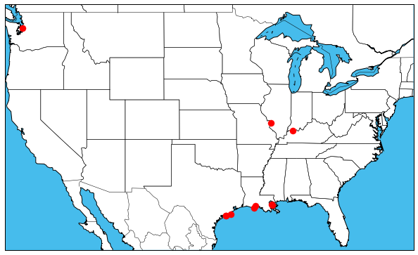
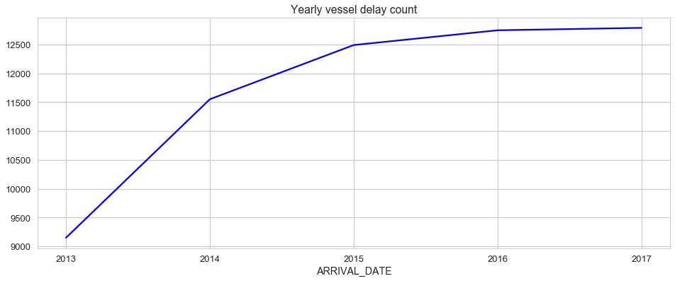

# Predicting Vessel Delays for Corps of Engineers-Lock Performance Management System (LPMS) Data: Milestone Report.
__Springboard Capstone 2 Milestone Report__

_By Heather A. Passmore, Ph.D._

****

### Report Outline:
1. Define the Problem
2. Client Profile
3. Description of LPMS Data
	4. Methods for Cleaning and Wrangling
	5. Conclusions for Data Processing
4. Additional Data: NOAA Weather
5. Explanations of Initial Findings
6. Sources

## 1.0 Define the Problem

Cargo vessel traffic on United States waterways and through US Army Corps of Engineers-managed locks plays an important role in the transport of foreign and domestic goods into and out of the United States. Locks are owned and operated by the US Army Corps of Engineers (USACE), range in age from 144 to 14 years since construction, and are considered by many to have surpassed their life-expectancy. Delays and failures of locks have immediate financial implications for shipping companies and for the USACE. 

My focus is to determine what factors predict delays for vessels as they approach locks and await lockage. The Lock Performance Management System (LPMS) logs 'delay-time' for individual vessels approaching a lock. Delay-time is the time elapsed from the arrival of a vessel at a lock to the start of lockage. To achieve this I selected ten focal locks with high traffic and high proportions of vessels with longer delay-times. Using logistic regression and random forest models my goal is to classify the conditions associated with vessel delays and identify features useful for predicting delays. My supervised learning models are built from daily vessel traffic at 10 focal locks over a period of 5 recent years (one vessel per lock per day as available). 

Because prior work focused on delays and failures of locks has not been performed on the national LPMS dataset I did not have _a priori_ hypotheses about the influential variables affecting vessel passage through locks. Instead, during the exploratory data analysis stage of my project I have developed clearer understanding of patterns in the data. My initial machine learning approach will focus on classifying whether a vessel is delayed (True/False) from variables related to vessel types, lock conditions, season, and weather conditions. 

## 2.0 Client Profile
The Institute for Water Resources (IWR) headquartered in Alexandria, VA is a Field Operating Activity of the United States Army Corps of Engineers (USACE) responsible for water resources planning and water management programs. One focused center of IWR is the Navigation and Civil Works Decision Support Center (NDC) and its Waterborne Commerce Statistical Center (WCSC) in New Orleans, LA. These entities focus on data collection organization for waterborne commerce, vessel characteristics, port facilities, dredging information, and information on navigation locks.

I am working directly with Steven Riley from the Navigation and Civil Works Decision Support Center. The NDC regularly analyzes commodity and transport data collected from lock operations. However, they have identified a need for a deeper analysis of the national network of waterway locks. Data exploration to find relationships relevant to budgeting, maintenance and scheduling would inform their planning for future operations. Specifically, NDC would like to know if increased lockage times indicate that a stoppage is imminent. Are there factors that could be used to predict delays and stoppages? 

My Final Report for Springboard and written report to USACE will include information on the variables that are most influential on vessel delays. USACE will be able to use general findings about influential variables from my report to frame future analysis and potentially future lock maintenance schedules. If delay times are difficult to predict or if outcomes vary widely across locations the results will still be valuable to USACE.

Internal Use: Predictive models of lockage delays will be useful to USACE for internal planning and scheduling. My model potentially can be designed to update and re-tune when additional years of data are available. These models could be useful to USACE and NDC into the future.

External Use: USACE makes some of their lock data available to the public through the [LPMS Public Web](http://corpslocks.usace.army.mil/lpwb/f?p=121:1:7534946428825:::::). They also produce annual reports for related topics like Waterborne Container Traffic, Commodity Indicators, Ports and State Data, Domestic Waterborne Traffic by Commerce Type, etc. Results of my analysis may inform some of this publicly shared analysis of US waterways traffic and locks. Having outwardly visible products is an important part of the mission of USACE and IWR to "provide forward-looking analysis and research in developing planning methodologies to aid the Civil Works program" and to provide " (a) analysis of emerging water resources trends and issues, (b) state-of-the-art planning and hydrologic engineering methods, models and training, and (c) national data management of results-oriented program and project information across Civil Works business lines."

## 3.0 Description of LPMS Data
The LPMS data are tables from US Army Corps of Engineers (USACE) Oracle Database with lock data from year 2000 through 2017. Data provided in comma-separated-values format (.csv) included the following tables:

* __TRAFFIC__, record of individual vessels as they approach and pass through locks, (~ 67105681 rows).
* __BARGE-TRAFFIC__, relationship between TRAFFIC and BARGE-TRAFFIC is not one-to-one because each vessel in TRAFFIC may have multiple barges, (3947393 rows).
* __BARGES__, details of flotillas, vessels, barge number and types, (15328548 rows).
* __FLOTILLAS__, specifications of flotilla (a group of barges) like width and length, (7132360 rows).
* __VESSELS__ table of vessel identifier and descriptor, (27058 rows).
* __STALL-STOPPAGE__, record of beginning time and ending time of stalls and stoppages that slow or halt navigation. Includes reason codes and comments,  (288818 rows).
* __CHAMBERMSTR__, details of lock structures used to move vessels through including number of chambers, length, width and type, (240 chambers).
* __LOCKMSTR__, list of division/district code (EROC), river code, lock number, lock name, and river mile for each lock, (196 locks).
* __RIVERMSTR__, river code and river name, (39 rivers)
* __DISTRICTS__, details for each EROC: district code, district name, district type, (33 districts).
* __LOCK-LOCATIONS__, latitude and longitude for each lock linked to EROC, River Code and lock number, (196 locks).

Initial processing for tables involved dividing large files by datetime fields, formatting fields, and creating calculated time events. Once  my first machine learning questions developed toward predicting where and when longer delays occurred, the data table most useful to me became the TRAFFIC table which documents the passage of each vessel through locks. I also used the STALL-STOPPAGE table to link scheduled and unscheduled events where navigation is either slowed (stalls) or halted (stoppages) to individual locks and days. Secondarily I used RIVERMSTR and LOCKMSTR to identify rivers and locks by name and LOCK-LOCATIONS to build maps.

### 3.1 Methods for Cleaning and Wrangling
__The TRAFFIC table__

The full traffic table with 17 years of vessel data at every lock is large so I used command line to subset 17-year dataset into individual years for last 5 years. I used csvkit with csvgrep to extract csv files of the traffic data by year, read them into Jupyter Notebook and concatenated them into a dataframe with 3039625 rows of vessel data. 

* Converted all date fields to datetime64[ns] dtype
	* ARRIVAL-DATE: 'When a vessel nears the Approach Point above or below the lock and signals that it is ready to use the lock. At this time, lock personnel designate a vessel as having joined the queue. For a lock with a long queue, the call to the lock may still place the vessel several miles away.'
	* SOL-DATE: 'Start of Lockage, The time when the chamber is ready to lock a vessel; signal to enter is given by the lock operator; it follows the EOL for the previous locked vessel and must be equal or later. It is the earliest of the stern of the outbound vessel being next to either the bow of the incoming vessel -OR- the designated Approach Point. It can be the same as the Arrival Time.'
	* BOW-OVER-SILL (BOS): 'The time when the bow of the entering vessel is abreast of the lock gates; it follows the SOL and must be later.' 
	* END-OF-ENTRY
	* START-OF-EXIT (SOE): 'Permission to begin exiting is given by the lock operator; it follows EOE and must be later.'
	* END-OF-LOCKAGE (EOL): 'When a lock has completed serving a vessel and can be dedicated to serving another vessel or when the stern of the vessel is next to the Approach Point (AP); it follows SOE and must be equal to or later than the next SOL.'
	* SIGNAL-DATE: 'The time when a multi-lockage flotilla, to include Setover, Jackknife, Knockout and Fast Double (also known as Multi-Chamber Lockage); is reconfigured for lockage prior to arrival.'
	* DEPARTURE-DATE: 'The time when a multi-lockage flotilla or a single lockage flotilla, to include Setover, Jackknife, Knockout and Fast Double (also known as Multi-Chamber), is reconfigured and ready to move. Departure time will be used only when reconfiguration is completed after the end of lockage time. (Optional)'
* Calculated ENTRY-TIME (Bow Over Sill to End Of Exit) in minutes.
* Calculated EXIT-TIME (Start Of Exit to End Of Lockage) in minutes.
* Calculated DELAY-TIME (Arrival Date to Start of Lockage) in minutes.
* Created column 'E-R-L' as a unique identifier for lock (EROC + RIVER-CODE + LOCK-NO = E-R-L) and for merging data between tables
* Created 'YYMMDD' from 'ARRIVAL-DATE' using .dt.date.
* Created 'hhmmss' column from 'ARRIVAL-DATE' using .dt.time.

Before proceeding with Exploratory Data Analysis and Inferential Statistics I took a uniform random sample of the five-year traffic dataset using

`# take a uniform random sample of rows from traffic_13_17`
`chosen_idx = np.random.choice(3039626, replace=False, size=392000)`
`traf_sample = traffic_13_17.iloc[chosen_idx]`

The resulting data frame has 392000 rows with eight datetime64[ns] columns, four float64 columns, four int64 columns, and seven object columns. From this even sample over the five-year period of my focus I will explore the distribution of delay-time for districts, rivers, locks as I determine my working definition of 'delay' and begin work to predict delay from lock, vessel and weather characteristics.

__The STALL_STOPPAGE Table__

The purpose of the stall-stoppage data for this project was two-fold. First, I used records of 'scheduled' stalls to remove vessel records at a lock on a day when there was a scheduled stoppage. Scheduled stoppages include regular maintenance, periods of time when personnel are not attending the lock, etc. These stall events may result in longer delay times as vessels approach locks, but I do not want to include them in my predictive model in my effort to determine what externals events cause delays for vessels. Next, I used the stall-stoppage table to extract information about unplanned stalls and stoppages and to connect the duration and reason-code of these unplanned stalls to the lock/day records in my machine learning dataset.

* BEG-STOP-DATE converted to datetime64[ns] dtype and made index.
* END-STOP-DATE made to datetime64[ns] dtype.
* Calculated stop-minutes and stop-days from BEG-STOP-DATE and END-STOP-DATE
* Created column 'E-R-L' as a unique identifier for lock (EROC + RIVER-CODE + LOCK-NO = E-R-L) and for merging data between tables.
* Created 'YYMMDD' from 'BEG-STOP-DATE' using .dt.date.

The five-year dataframe of stall stoppage data has 288818 entries. In subsequent steps I divided the table into separate dataframes for scheduled and unscheduled stalls (SCHEDULED = True or False). Where there was a scheduled stall stoppage at a lock on a day I removed data for that lock/day from the Traffic dataframe so that scheduled stalls did not inflate the measure of delay  or influence model predictions of delay. Further, I used pivot_table on the dataframe of unscheduled stalls to produce a data frame with one record per lock per day with columns for each REASON-CODE and the mean of delay-time for that day/reason in each cell. This table, merged with the traffic table increases the type of information available for building the models.

__The RIVERMSTR, LOCKMSTR and LOCK-LOCATIONS Tables__

The river-master and lock-master tables allowed me to link more recognizable names to the rivers and locks during analysis and for presentation purposes. 

The lock-locations table includes latitude and longitude coordinates for each lock. With these I used matplotlib's basemap to plot maps of all lock locations (Figure 1) and for the 10 focal locks for the machine learning (Figure 2).

__Figure 1.__ Locations of 196 locks owned or managed by the US Army Corps of Engineers and monitored with the Lock Performance Monitoring System (LPMS). 

### 3.2 Conclusions for Data Processing

__One definition of delay__ My initial effort to define the length of time to define as a 'delay' for a vessel approaching a lock is chronicled in the ['Data Story EDA Statistics LPMS'](https://github.com/PassMoreHeat/springboard/blob/master/Capstone_2/Data_Story_EDA_Statistics_LPMS.ipynb) notebook. I determined from this work that defining the same length of delay for all locks is not appropriate. Including only non-zero delay-times I calculated the 75th percentile of delay time and assigned delay 'True' or 'False' to all vessels in the traffic dataframe. With delay-time of 110 minutes or more the overall proportion of vessels delayed was 0.16. However, the proportion of delays per lock varied widely. Two locks had over 85% of vessels 'delayed,' seven other locks had 40 to 60% of vessels with delay-times over 110minutes.

Based on EDA of delay_time per vessel I determined 'Delay' must be defined per lock. Each lock has different factors (age, lockage type, river traffic) that affects the normal lockage time. A delay of 110 minutes on the Hudson may be extreme while a delay of that length at the Industrial Canal in New Orleans is very common (80% of vessels take that long or longer).
The Inner Harbor Navigation Canal Lock (in New Orleans) was built in 1920 and has had some repairs but is a slowdown for several reasons:

> "the 1920s vintage lock has become a bottleneck between the nation's two highest-tonnage waterways—the Mississippi and the Gulf Intracoastal Waterway."
> 
> "...three different waterways—the Industrial Canal, the Intracoastal and the MRGO—were now using the same lock to connect to the river."
> 
> From: https://en.wikipedia.org/wiki/Industrial_Canal_Lock

__Define delay on a lock-by-lock basis__ My second attempt to define 'delay' for vessels waiting to enter lockage takes into account the actual differences in wait-times for each lock. Instead of calculating the 75th percentile of all delay-times, I applied a function to calculate the 75th percentile of delay-time for each lock. While this produced a similar overall proportion of delays in the full dataset (proportion delay = 'True' is 0.15), the proportions of delayed vessels per lock were much reasonable (delayed vessel proportions at high traffic locks are all 0.25 or lower). The code and exploratory analysis is in notebook ['EDA Per Lock and Table Build'](https://github.com/PassMoreHeat/springboard/blob/master/Capstone_2/EDA_Per_Lock_and_Table_Build.ipynb). Ultimately, I produced dataframes ready for machine learning with one row per lock per day over the five-year period of this study. The steps I took to define delay and filter down to one vessel per lock per day were:

1. Calculate 75th percentile delay per lock. (Longest delay definition was 1755 minutes)
2. Apply defined delay per lock to each vessel record (row) 
3. Explore patterns of delay per EROC, River, Lockage, Lock
4. Assign delay categories HIGH or LOW to individual locks based on proportion of delays
5. Explore patterns in delay count by year, month, day for vessels
6. Examine delays per lock & per day
7. Add stall stoppage information to main traffic delay dataframe
8. Start to build focal dataframe for machine learning (selected 10 high-traffic locks with high delay proportions)
9. Delete unnecessary columns, create full and reduced datasets for ML

__Figure 2.__ Locations of 10 focal locks for the machine learning steps incorporating weather data. Lock locations are marked with red circles. Focal locks are located in 5 states: Texas (3 nearby locks), Indiana (1), Illinois (1), Louisiana (4 locks — two pairs of nearby locks), and Washington (1).

## 4.0 Additional Data: NOAA Weather

In addition to Lock Performance Management System data provided by USACE I also have identified a source for historical weather data. The National Oceanic and Atmospheric Administration's (NOAA) National Centers for Environmental Information provides free data from certain weather station across the United States (Figure 3). Using the ['Data Tool: Find a Station'](https://www.ncdc.noaa.gov/cdo-web/datatools/findstation) feature I identified 7 airport weather stations near focal lock locations. Three of these weather stations were near to two locks each and the data will be applied to both locations. 

__Figure 3.__ Locations of available historical daily temperature, precipitation, and wind weather records from NOAA's National Centers for Environmental Information (https://www.ncdc.noaa.gov/cdo-web/datatools/findstation)

For all seven airport weather stations I was able to acquire 100% of daily summaries for the five-year study period. The data categories I selected were: Air Temperature, Precipitation, Wind, and Weather Type. Please see [Data Wrangling Report](https://github.com/PassMoreHeat/springboard/blob/master/Capstone_2/Data_Wrangling_Report.md) for details of these variables. 

My final dataframe for the machine learning stage of this project includes one vessel per day per lock at ten different USACE locks with high traffic. Linked to each lock per day I have daily weather summaries in these categories relevant to vessel traffic on waterways.

## 5.0 Explanation of Initial Findings

Through exploration of full 5-year vessel traffic data set I identified factors associated with differences between delayed and not-delayed vessels. Overall, the number of delayed vessels at USACE locks increased over the five-year study period (Figure 4). In addition, seasonal patterns of vessel delays indicate delay rates are reduced by half during winter months (Figure 5).

__Figure 4.__ _Yearly counts of delayed vessels across all USACE locks from 2013 through 2017. Frequency of extended delays increases over time. Delay is defined as the recorded delay-times greater than the 75th percentile of delay time at a given lock._

__Figure 5.__ _Monthly counts of delayed vessels across all USACE locks from 2013 through 2017. Delay frequency has a seasonal pattern with fewer delays, and perhaps less vessel traffic during the colder seasons. Delay is defined as the recorded delay-times greater than the 75th percentile of delay time at a given lock._

Focal locks are located within 5 separate Districts and on 5 different rivers. During the period of study half of the focal locks have higher numbers of delay-days (days when there is at least one delayed vessel approaching the lock) than non-delay days (Figure 6). One factor that may affect vessel passage through locks is lockage-type. Lockage-type is the configuration of vessels as they transit a lock. Although this factor may be more likely to affect approach time and delay time for subsequent vessels than for the focal vessel (if different lockage-types have more complex procedures for entering and exiting locks) we find reason to include it in this study. In the focal lock dataset Open Passage (O) and Straight (S) lockages are the most common (Figure 7).

__Figure 6.__ _For 50% of focal locks there are more delay-days than non-delay-days over the period of study. Codes for lock identification, 'E-R-L', indicate the District, River, and Lock codes. Target binomial delay-cat, delay = 1, no-delay = 0._

__Figure 7.__ _Lockage-type, the configuration of vessels as they transit a lock, is more likely to affect approach time and delay time for subsequent vessels if passage is delayed during lockage. Here Open Passage (O) and Straight (S) lockages are the most common lockage types._

Weather conditions may affect delay-times as vessels approach locks. Although this is not a factor that USACE can control, understanding the effects of weather types and extreme weather events could help USACE develop contingency plans for various seasons and specific weather conditions. In my final report I will explore relationships between weather and vessel delays. By fitting classification models I will determine whether there are lock, vessel, or weather related factors that are associated with delays at the ten focal locks.

## 6.0 Helpful Resources
[FactCard](http://www.navigationdatacenter.us/factcard/FactCard2016.pdf), 2016. The US Waterway System 2016 Transportation Facts & Information. Navigation and Civil Works Decision Support Center, US Army Corps of Engineers. http://www.navigationdatacenter.us/factcard/FactCard2016.pdf

[LPMS Public Web](http://corpslocks.usace.army.mil/lpwb/f?p=121:1:7534946428825:::::) http://corpslocks.usace.army.mil/lpwb/f?p=121:1:7534946428825:::::

[Waterborne Commerce National Summary](http://www.navigationdatacenter.us/wcsc/pdf/wcusnatl16.pdf), 2016. In Waterborne Commerce of the United States, Calendar year 2016, Part 5-National Summaries. Compiled under the supervision of the Institute of Water Resources, USACE, Alexandria, VA. http://www.navigationdatacenter.us/wcsc/pdf/wcusnatl16.pdf

Yu, T.E, B.C. English and R.J. Menard. 2016. Economic Impacts Analysis of Inland Waterway Disruption on the Transport of Corn and Soybeans. Staff Report #AE16-08. Department of Agricultural and Resource Economics, University of Tennessee.

***
Copyright 2018 Heather A. Passmore